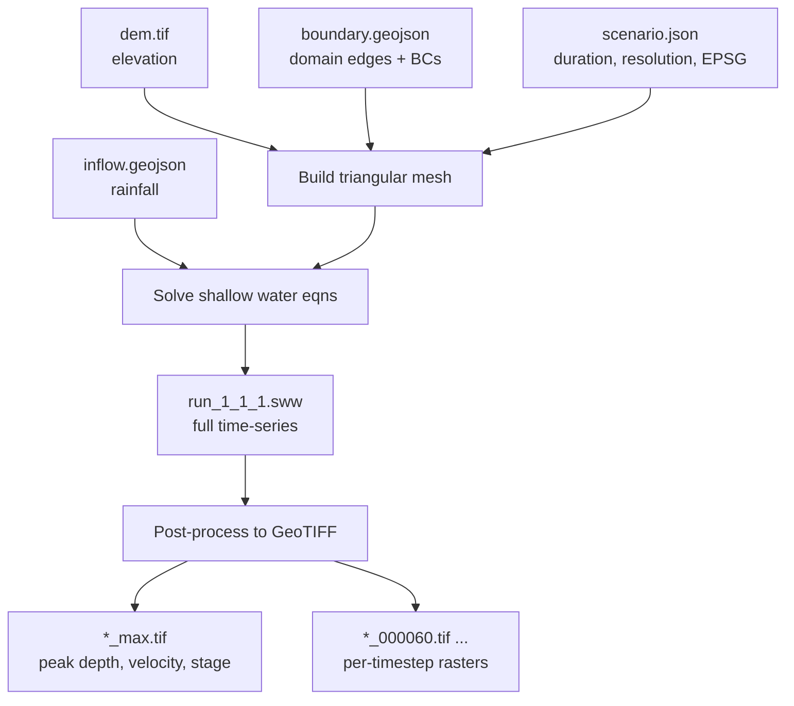
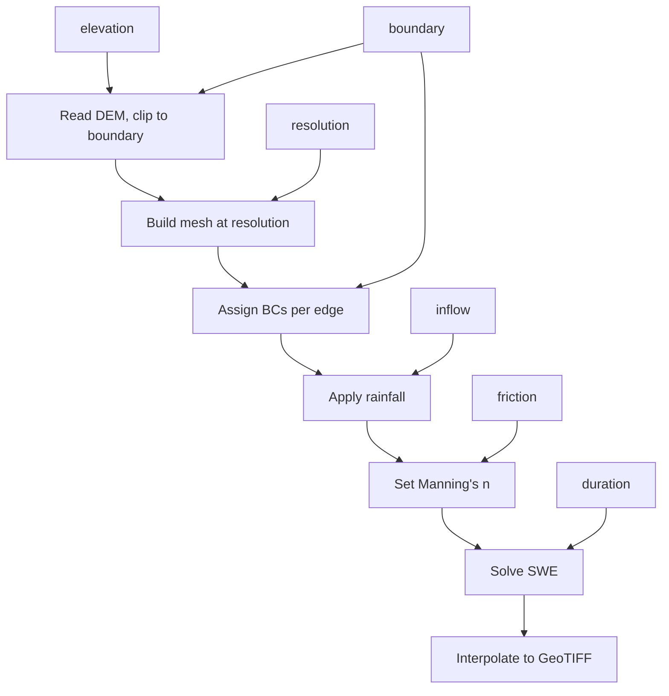

# run-anuga

[](https://github.com/Hydrata/run_anuga/actions/workflows/ci.yml)
[](https://github.com/Hydrata/run_anuga/actions/workflows/release.yml)

Standalone [ANUGA](https://github.com/anuga-community/anuga_core) flood simulation on Windows and Linux. No Python install required.

## 1. Download

Single standalone executable. No Python, no installers, no dependencies.

**[Download for Windows (~165 MB .zip)](https://github.com/Hydrata/run_anuga/releases/latest/download/run-anuga-windows-amd64.zip)** | [All releases](https://github.com/Hydrata/run_anuga/releases)

A Linux tarball (`run-anuga-linux-amd64.tar.gz`) is also available on the releases page.

Extract the zip. You'll get:

```
run-anuga-windows-amd64.exe
examples/
  small_test/
    scenario.json
    inputs/
      dem.tif
      boundary.geojson
      inflow.geojson
```

> **Windows SmartScreen:** You'll likely get a "Windows protected your PC" warning on first run.
> Click **More info** then **Run anyway**. This is normal for unsigned executables.

## 2. Running the Test Simulation

Open Command Prompt or PowerShell and `cd` to the folder where you extracted the files.

### Validate the scenario

```
run-anuga-windows-amd64.exe validate examples\small_test\scenario.json
```

Expected output:

```
Valid scenario: run_1_1_1
  Duration: 1800s, EPSG: EPSG:28356
  Resolution: 5.0m
```

### View scenario info

```
run-anuga-windows-amd64.exe info examples\small_test\scenario.json
```

### Run the simulation

```
run-anuga-windows-amd64.exe run examples\small_test\scenario.json
```

Takes roughly 1-3 minutes. ANUGA prints timestep output as it solves.
When complete, results appear in `examples\small_test\outputs_1_1_1\`.

### Output files

```
outputs_1_1_1/
  run_1_1_1.sww                                  Full time-series (NetCDF)
  run_1_1_1_depth_max.tif                        Max water depth
  run_1_1_1_velocity_max.tif                     Max flow velocity
  run_1_1_1_depthIntegratedVelocity_max.tif      Max depth x velocity
  run_1_1_1_stage_max.tif                        Max water surface elevation
  run_1_1_1_depth_000000.tif                     Depth at t=0s
  run_1_1_1_depth_000060.tif                     Depth at t=60s
  run_1_1_1_depth_000120.tif                     Depth at t=120s
  ...                                            (one per 60s timestep)
  checkpoints/                                   Restart files
```

The `*_max.tif` files are the main outputs for design work. They're standard GeoTIFFs
that load directly into QGIS, ArcGIS, or any GIS software.

## 3. How It Works

The simulation pipeline reads a scenario package (a folder with `scenario.json` and input files),
runs ANUGA's shallow water equation solver, then post-processes the results to GeoTIFF rasters.



The `scenario.json` file ties everything together. It references the input filenames
and sets the simulation parameters (duration, resolution, coordinate system).
Here's how each field feeds into the processing pipeline:



## 4. Test Model Details

### Domain

| Property | Value |
|----------|-------|
| Coordinate system | EPSG:28356 (GDA94 / MGA Zone 56) |
| Domain size | 200 m x 200 m |
| Elevation | 1 m LiDAR DEM (Geoscience Australia ELVIS, CC BY 4.0) |
| Mesh resolution | 5 m (max triangle area 12.5 m²) |
| Duration | 1800 s (30 min) |
| Manning's n | 0.04 (default, no friction zones defined) |
| Rainfall | 50 mm/hr uniform over entire domain, constant for full duration |

### Boundary conditions

```
              North (Transmissive)
        +-------------------------------------+
        |                                     |
  West  |           200 m x 200 m             | East
(Refl.) |                                     | (Refl.)
        |          50 mm/hr rainfall          |
        |           over full domain          |
        |                                     |
        +-------------------------------------+
              South (Transmissive)
```

| Edge | Type | Effect |
|------|------|--------|
| North | Transmissive | Open — water exits freely |
| South | Transmissive | Open — water exits freely |
| East | Reflective | Wall — no flow through |
| West | Reflective | Wall — no flow through |

Boundaries are defined as LineString features in `boundary.geojson`. Each feature has
a `"boundary"` property (`"Transmissive"` or `"Reflective"`) and a `"location": "External"`
property. The lines must connect end-to-end to form a closed polygon.

### Rainfall

Defined in `inflow.geojson` as a single Polygon feature covering the full domain.
Properties: `"type": "Rainfall"`, `"data": "50.0"` (mm/hr).
Applied as a uniform source term for the full simulation duration.

### Input file formats

| File | Format | Notes |
|------|--------|-------|
| `scenario.json` | JSON | References all other files, sets simulation parameters. |
| `inputs/dem.tif` | GeoTIFF | Ground elevation raster. Must match the scenario's EPSG. |
| `inputs/boundary.geojson` | GeoJSON (LineStrings) | Domain edges. Each feature needs `"boundary"` property. Must form closed polygon. |
| `inputs/inflow.geojson` | GeoJSON (Polygons) | Rainfall/inflow zones. `"type": "Rainfall"`, `"data"` = rate in mm/hr. |

### Viewing in QGIS

1. Set project CRS to **EPSG:28356** (Project > Properties > CRS).
2. Drag `inputs/dem.tif` onto the map to see the elevation surface.
3. Drag `inputs/boundary.geojson` and `inputs/inflow.geojson` to see the domain outline and rainfall zone.
4. After running, drag the `*_max.tif` files from `outputs_1_1_1/`:
   - `depth_max.tif` — blue colour ramp works well
   - `velocity_max.tif` — red/yellow ramp
5. The timestep TIFFs (`*_000060.tif`, `*_000120.tif`, ...) can be loaded as a time series.

> **Nodata:** Output GeoTIFFs use **-9999** as nodata. In QGIS: right-click layer > Properties >
> Transparency > add -9999 as "No data value" so dry cells render as transparent.

## 5. Output Quantities

| Quantity | Units | Description |
|----------|-------|-------------|
| `depth` | m | Water depth above ground surface. |
| `velocity` | m/s | Flow speed (magnitude of velocity vector). |
| `depthIntegratedVelocity` | m²/s | Depth x velocity. Relevant for flood hazard assessment (VxD). |
| `stage` | m AHD | Water surface elevation (ground + depth). For checking levels against survey. |

For each quantity:

- **Timestep rasters** — `*_000060.tif`, `*_000120.tif`, ... (one per 60 s output interval)
- **Maximum envelope** — `*_max.tif` (peak value at each cell across all timesteps)

The `.sww` file is ANUGA's native NetCDF format — the full unstructured mesh time-series
at higher temporal resolution than the raster snapshots.

## 6. Scenario Configuration Reference

`scenario.json` controls the simulation. All file paths are relative to an `inputs/`
subfolder alongside the JSON file.

| Field | Required | Description |
|-------|----------|-------------|
| `format_version` | Yes | Must be `"1.0"` |
| `epsg` | Yes | Projected CRS for all inputs, e.g. `"EPSG:28356"` |
| `boundary` | Yes | Boundary GeoJSON filename |
| `duration` | Yes | Simulation length in seconds |
| `resolution` | No | Base mesh resolution in metres |
| `elevation` | No | DEM GeoTIFF filename |
| `inflow` | No | Rainfall/inflow GeoJSON filename |
| `friction` | No | Manning's roughness zones GeoJSON |
| `structure` | No | Building footprints GeoJSON (raised 5 m in the DEM) |
| `mesh_region` | No | Mesh refinement zones (finer mesh in areas of interest) |
| `name`, `description` | No | Human-readable labels |
| `id`, `run_id`, `project` | No | Numeric IDs — used to name the output folder (`outputs_{project}_{id}_{run_id}`) |
| `model_start` | No | ISO 8601 start time (for reference only, doesn't affect solver) |

### Boundary types

| Type | Effect | Use case |
|------|--------|----------|
| `Transmissive` | Water passes through freely | Open downstream boundary, tidal boundary |
| `Reflective` | Solid wall, no flow | Ridgeline, embankment, domain edge with no outflow |
| `Dirichlet` | Fixed water level (0 m) | Known tailwater level |

### Inflow types

| Type | `"data"` field | Effect |
|------|---------------|--------|
| `Rainfall` | Rate in mm/hr (as string) | Uniform rainfall applied over the polygon area for full duration |

## 7. Current Limitations

This is a v0.1.0 — the core simulation pipeline works, but there are gaps
that matter for production design work.

### Hydrology & loading

- **No time-varying rainfall** — only constant-rate. No IFD hyetographs or temporal patterns.
- **No hydrograph inflows** — can't apply a Q(t) at a boundary or point source.
- **No time-varying boundary levels** — Dirichlet boundaries are fixed at 0 m. No tidal curves.

### Domain & hydraulics

- **No culverts, bridges or weirs** — ANUGA supports these but they're not yet exposed in the scenario format.
- **Friction zones not tested** — the `friction` field exists in the schema but hasn't been validated. Everything currently gets n=0.04.
- **Buildings are crude** — footprints are raised 5 m in the DEM (effectively solid blocks). No flow-through or variable resistance.
- **No GUI** — scenario packages must be assembled manually (JSON + GeoJSON files).

### Outputs

- **No hazard classification** — raw depth/velocity only. No H1-H6 categories per ARR.
- **No flood extent polygons** — no shapefile/GeoJSON of the flood boundary at a given depth threshold.
- **No reporting** — no PDF summary, no peak level table at specified points.

### Performance

- **Single-threaded only** — no parallel execution. ANUGA supports MPI but the Windows exe can't use it.
- **No progress indicator** — ANUGA prints timestep output but no percentage or ETA.

## 8. Feedback

This is an early version. We're deciding what to build next based on what's
actually useful in practice.

**Try it with your own data** — Copy the `small_test` folder structure, swap in your own DEM
and boundary files, update `scenario.json`. What goes wrong? What error messages don't make sense?

**What does your current workflow look like?**
- Do you use ARR Data Hub design storms? Which durations and AEPs?
- Do you need hydrograph inflows from RORB / WBNM / RAFTS / XP-RAFTS?
- Do you model culverts, bridges, or levees?
- Do you need to compare pre- vs post-development scenarios?
- What outputs do you actually deliver? (flood extents, hazard maps, peak level tables, report PDFs?)

**What output formats matter?**
- GeoTIFF sufficient, or do you need MapInfo TAB, shapefile, etc.?
- Flood extent polygons at a threshold depth?
- Peak level / peak velocity at nominated survey points?
- Flood hazard categories (VxD classification)?

**What breaks?** — The exact command, the error output, and what you expected.

Send feedback to [david.kennewell@hydrata.com](mailto:david.kennewell@hydrata.com) or
[open an issue](https://github.com/Hydrata/run_anuga/issues).

---

## Developer Guide

The sections below are for developers working with run_anuga as a Python package.

### Installation

```bash
# Core only — config parsing, validation, CLI (no geo deps)
pip install run_anuga

# With simulation dependencies (rasterio, numpy, shapely, geopandas, etc.)
pip install "run_anuga[sim]"

# With visualisation (matplotlib, opencv)
pip install "run_anuga[viz]"

# With platform integration (requests, boto3, pystac)
pip install "run_anuga[platform]"

# Everything (sim + viz + platform + anuga + celery + django)
pip install "run_anuga[full]"

# Development tools (pytest, ruff)
pip install "run_anuga[dev]"
```

### System Dependencies

ANUGA requires MPI for parallel simulations. Install MPI libraries before `pip install`:

**Debian / Ubuntu:**

```bash
sudo apt-get install build-essential gfortran \
    libopenmpi-dev openmpi-bin \
    libhdf5-dev libnetcdf-dev
```

All Python dependencies install from binary wheels — no system-level GDAL, PROJ, or GEOS needed.

**ANUGA undeclared dependencies:** The `anuga` package (v3.2) only declares `numpy` in its metadata, but requires several additional packages at import time:

```bash
pip install "run_anuga[sim]" anuga mpi4py matplotlib scipy triangle netCDF4 pymetis
```

### CLI Usage

```bash
run-anuga validate /path/to/package/
run-anuga info /path/to/package/
run-anuga run /path/to/package/
run-anuga run /path/to/package/ --username user@example.com --password secret
run-anuga run /path/to/package/ --batch-number 2 --checkpoint-time 1800
run-anuga post-process /path/to/package/
run-anuga viz /path/to/outputs/ depth
run-anuga upload /path/to/outputs/ --bucket my-bucket
```

### Python API

```python
from run_anuga.config import ScenarioConfig

config = ScenarioConfig.from_package("/path/to/package")
print(config.run_label)   # "run_42_1_7"
print(config.duration)    # 3600
print(config.epsg)        # "EPSG:28355"

from run_anuga.run import run_sim
from run_anuga.callbacks import LoggingCallback

run_sim("/path/to/package", callback=LoggingCallback())
```

### Defaults

All simulation constants are defined in `run_anuga/defaults.py`:

| Constant | Value | Description |
|----------|-------|-------------|
| `BUILDING_BURN_HEIGHT_M` | 5.0 | Height added to DEM for buildings |
| `BUILDING_MANNINGS_N` | 10.0 | Manning's n for building footprints |
| `DEFAULT_MANNINGS_N` | 0.04 | Default Manning's roughness |
| `RAINFALL_FACTOR` | 1.0e-6 | mm/hr to m/s conversion factor |
| `MINIMUM_STORABLE_HEIGHT_M` | 0.005 | Min depth stored in SWW |
| `MIN_ALLOWED_HEIGHT_M` | 1.0e-5 | Min depth for velocity extrapolation |
| `MAX_YIELDSTEPS` | 100 | Max yield steps per simulation |
| `MIN_YIELDSTEP_S` | 60 | Min yield interval (seconds) |
| `MAX_YIELDSTEP_S` | 1800 | Max yield interval (seconds) |
| `MAX_TRIANGLE_AREA` | 10,000,000 | Max triangle area for mesher |
| `K_NEAREST_NEIGHBOURS` | 3 | Neighbours for GeoTIFF interpolation |

### Testing

```bash
# Unit tests (no ANUGA required)
pytest tests/ -v --ignore=tests/test_integration.py

# Integration tests (requires ANUGA + MPI)
pytest tests/test_integration.py -v

# Docker-based README validation
bash test-docker/test_readme.sh
```

## License

MIT

---

Built on [ANUGA Hydro](https://en.wikipedia.org/wiki/ANUGA_Hydro) (Geoscience Australia / ANU).
Test model elevation data: Commonwealth of Australia (Geoscience Australia), CC BY 4.0.
